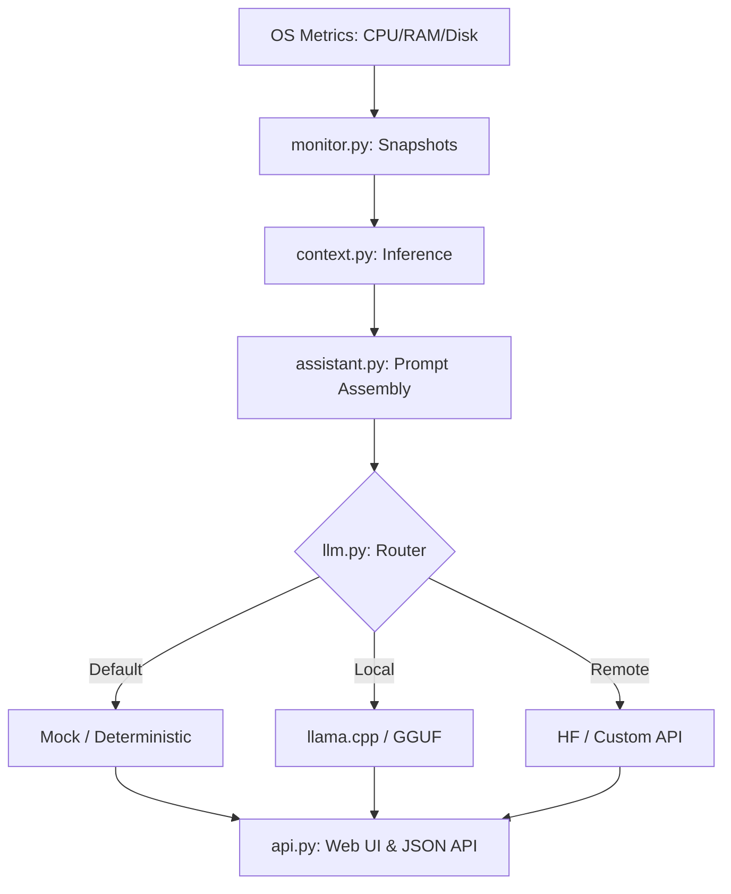

# OS-Level AI Daemon (OSAD)

A local-first system intelligence daemon that runs in the background of your OS.  
It observes system state, applies lightweight heuristics, and exposes a private API for contextual suggestions and automation.

No cloud dependency. No surveillance. Mocked LLMs by default.

---

## 🧠 Philosophy

Most “AI assistants” are chat boxes wearing a lab coat.  
OSAD is a background systems brain that understands whether you're compiling code, gaming, or idle and reacts accordingly.

- **Privacy First** — Sensitive data is aggressively redacted before touching any model
- **Resource Aware** — Runs at low priority and stays out of your way
- **Pluggable** — Mock mode, local GGUF models, or remote APIs

---

## 🏗️ Architecture



---

## 🚀 Quickstart

### 1. Clone repository
```bash
git clone https://github.com/yourutils/os-ai-daemon.git
cd os-ai-daemon
```

### 2. Setup virtual environment
```bash
python -m venv .venv
source .venv/bin/activate      # Windows: .venv\Scripts\activate
```

### 3. Install dependencies
```bash
pip install -r requirements.txt
```

---

## Running the Daemon

Single cycle check:
```bash
python main.py --once
```

Continuous monitoring:
```bash
python main.py --monitor
```

---

## Launch the Interface

Start the local API server:

```bash
python api.py
```

Open dashboard:

```
http://127.0.0.1:8000
```

---

## ⚙️ Configuration

Environment variables:

| Variable           | Description                                  | Default |
|-------------------|----------------------------------------------|-------|
| LLM_BACKEND       | mock, llama_cpp, hf_api, remote             | mock |
| LOG_LEVEL         | DEBUG, INFO, WARNING                        | INFO |
| LLAMA_MODEL_PATH  | Path to `.gguf` model                       | None |
| HF_TOKEN          | HuggingFace API token                       | None |
| DAEMON_INTERVAL   | Seconds between system snapshots            | 5 |

---

## 🛠️ Features & Modules

### Intelligence
- `context.py` — Detects states (idle, work, gaming, streaming)
- `privacy.py` — Filters sensitive process data
- `learning.py` — Local preference memory (SQLite/JSON)

### Monitoring & Security
- `monitor.py` — CPU, RAM, disk, and network snapshots
- `security.py` — Heuristic anomaly detection
- `maintenance.py` — Disk failure prediction & cleanup alerts

---

## 📡 Local API Endpoints

| Method | Endpoint        | Description |
|------|------|------|
| GET  | /api/suggest   | AI suggestions from system context |
| GET  | /api/metrics   | Raw system snapshot |
| POST | /api/generate  | Direct LLM interaction |
| GET  | /api/scan      | Security/anomaly scan |

---

## 🤝 Contributing

1. Fork the project  
2. Create branch: `git checkout -b feature/AmazingFeature`  
3. Commit: `git commit -m "Add AmazingFeature"`  
4. Push: `git push origin feature/AmazingFeature`  
5. Open Pull Request

---

## 📄 License

Distributed under the MIT License. See `LICENSE` for details.
